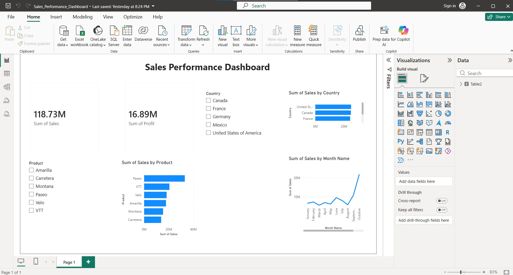

# 📊 Sales Performance Dashboard

## Project Overview
This project is an interactive Sales Performance Dashboard created using Power BI to analyze sales performance across products, countries, and months.

## Tools Used
- Power BI
- Microsoft Excel
- SQL
- DAX

## Dashboard Features
- Total Sales KPI
- Total Profit KPI
- Sales by Product
- Sales by Country
- Monthly Sales Trend
- Product and Country Slicers

## Key Insights
- Paseo generated the highest sales.
- Sales performance changes across different months.
- Canada, France, Germany, Mexico, and the USA contribute significantly to overall sales.

## Files Included
- Sales_Performance_Dashboard.pbix
- Sample_Data.xlsx

## Dashboard Preview

## Author
**Sakshi**

